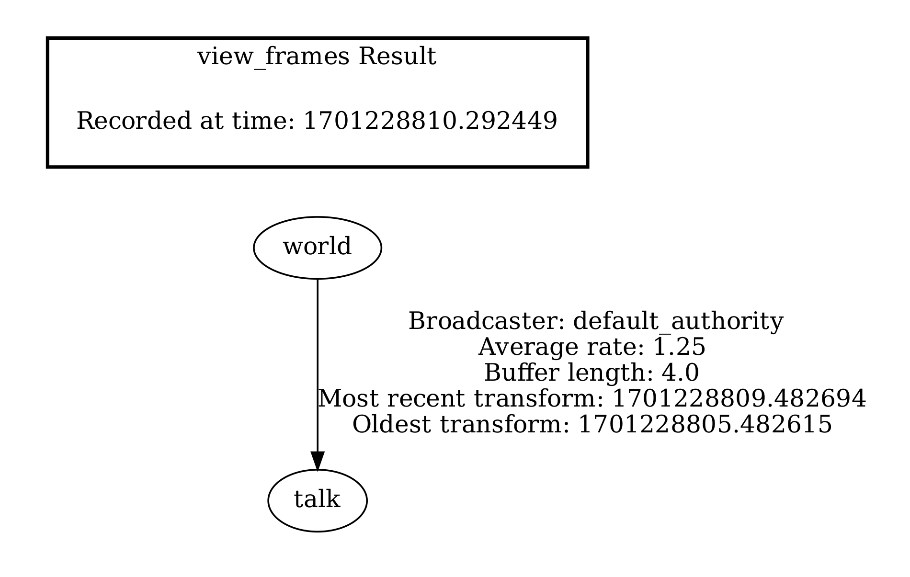
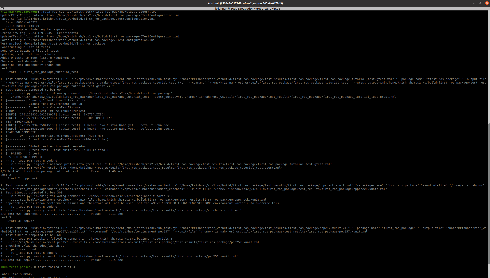
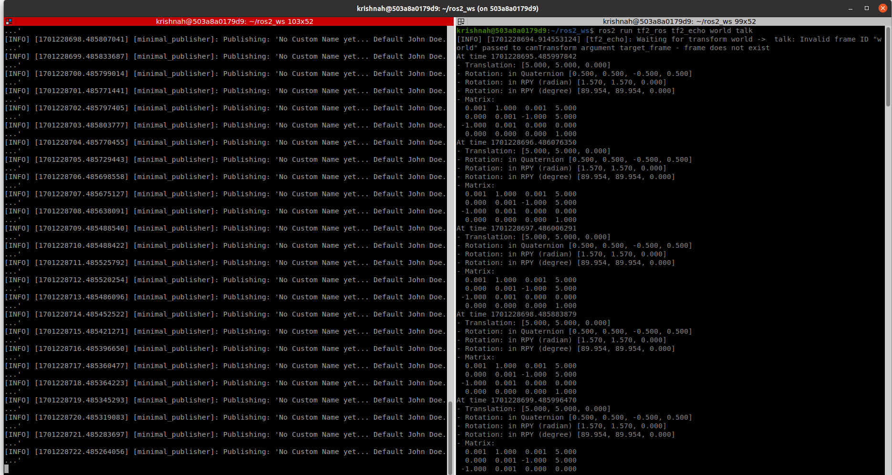

# beginner_tutorials

## Overview
This repository contains a ros2 package(C++) with two nodes, one publishier and one subscribing node.
Publisher publishes a message on the topic and subscriber by subscribing to that topic recieves that messages and prints on the terminal.

During this assignment, I added a service that when called can change the message that publisher is publishing on the topic.

Furthermore, I added publishing frequency as a parameter that can be updated from as the argument from the launch command.

I extensively used all the five logging levels, and the detailed results are mentioned in below sections.

Now during this assignment, below updates have been made:
1. Updated the publisher to broadcast a tf frame called /talk with parent /world. The transform have non-zero translation and rotation. 
2. Creted a gtest to test the talker node.
3. Updated the ROS launch file, to generate a rosbag to store the validations of the outputs of the nodes.


## Dependencies
* ROS 2 Humble
* Ubuntu 22.04

## Build Instructions
```
source /opt/ros/humble/setup.bash

mkdir -p ~/ros2_ws/src

cd ~/ros2_ws/src

git clone https://github.com/KrishnaH96/beginner_tutorials.git

cd ..

rosdep install -i --from-path src --rosdistro humble -y

colcon build 

```

## Run instructions

### To check the TF message:

#### First terminal: Run the talker node:

```
source /opt/ros/humble/setup.bash

cd ros2_ws

source install/local_setup.bash

ros2 run first_ros_package talker

```
#### Second terminal: Run the below command to check the transforms published on the topic

```
source /opt/ros/humble/setup.bash

source install/local_setup.bash

# Run below command to view the frames over console
ros2 run tf2_ros tf2_echo world talk

# Run below command that saves these frames to pdf in the current directory
ros2 run tf2_tools view_frames

```
--------------------------------------------


### Gtest instructions
Below instructions will let you run the gtests anb check the details of these tests on the terminal.

```
source /opt/ros/humble/setup.bash

cd ros2_ws

source install/local_setup.bash

# To run the gtests:
colcon test --packages-select first_ros_package

# To view the results of the above test:
cat log/latest_test/first_ros_package/stdout_stderr.log

```
--------------------------------------------

### ROS Bag:

Follow below instruction

```
source /opt/ros/humble/setup.bash

cd ros2_ws

source install/local_setup.bash

ros2 launch first_ros_package nodes_launch.py ros2_bag_start:=True

```
I have added the recorded bag file in the file rosbag2 inside the package, run below command to check the rosbag I generated:


```
source /opt/ros/humble/setup.bash

cd ros2_ws

source install/local_setup.bash

cd src/beginner_tutorials/rosbag2/

#Check the rosbag using below command.
ros2 bag info rosbag2.db3

#Use below command to playback the contets of the bag
ros2 bag play rosbag2.db3

```
--------------------------------------------
### Below are the instructions to update the talker node using service:

#### First terminal: Using Launch python script launch the nodes, publishing frequency can be updated as an argument

```
source /opt/ros/humble/setup.bash

cd ros2_ws

source install/local_setup.bash

ros2 launch first_ros_package nodes_launch.py publish_frequency:=800

```

#### In Second Terminal: To launch the listener

```
source /opt/ros/humble/setup.bash

cd ros2_ws

source install/local_setup.bash

ros2 run first_ros_package listener

```

#### In third Terminal: Call the service and change the name to publish.

```
source /opt/ros/humble/setup.bash

cd ros2_ws

source install/local_setup.bash

ros2 service call /change_string first_ros_package/srv/ChangeString  "{first_name: 'Krishna', last_name : 'Hundekari'}"

```


## Results


1. frames view:



2. gtest results:



3. Tranfomrs echo:




. With Frequncy 500:
We will get the warn message.


2. With Frequncy 1200:
We will get the fatal message.


