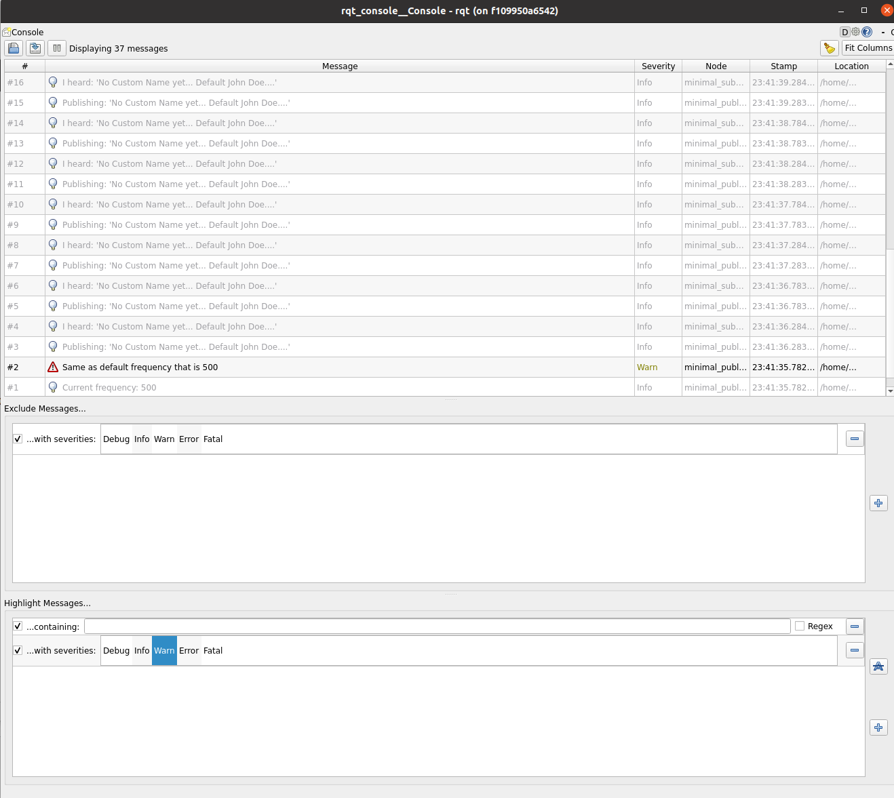
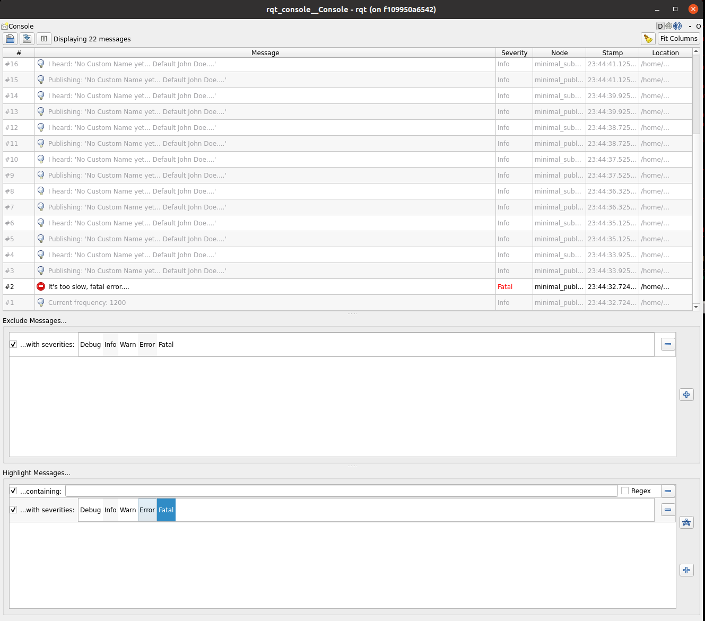

# beginner_tutorials

## Overview
This repository contains a ros2 package(C++) with two nodes, one publishier and one subscribing node.
Publisher publishes a message on the topic and subscriber by subscribing to that topic recieves that messages and prints on the terminal.

During this assignment, I added a service that when called can change the message that publisher is publishing on the topic.

Furthermore, I added publishing frequency as a parameter that can be updated from as the argument from the launch command.

I extensively used all the five logging levels, and the detailed results are mentioned in below sections.

## Dependencies
* ROS 2 Humble
* Ubuntu 22.04

## Build Instructions
```
source /opt/ros/humble/setup.bash

mkdir -p ~/ros2_ws/src

cd ~/ros2_ws/src

git clone https://github.com/KrishnaH96/beginner_tutorials.git

cd ..

rosdep install -i --from-path src --rosdistro humble -y

colcon build 

```

## Run instructions

### First terminal: Using Launch python script launch the nodes, publishing frequency can be updated as an argument

```
source /opt/ros/humble/setup.bash

cd ros2_ws

source install/local_setup.bash

ros2 launch first_ros_package nodes_launch.py publish_frequency:=800

```

### In Second Terminal: To launch the listener

```
source /opt/ros/humble/setup.bash

cd ros2_ws

source install/local_setup.bash

ros2 run cpp_pubsub listener

```

### In third Terminal: Call the service and change the name to publish.

```
source /opt/ros/humble/setup.bash

cd ros2_ws

source install/local_setup.bash

ros2 service call /change_string first_ros_package/srv/ChangeString  "{first_name: 'Krishna', last_name : 'Hundekari'}"

```


## Results

1. With Frequncy 500:
We will get the warn message.



2. With Frequncy 1200:
We will get the fatal message.




